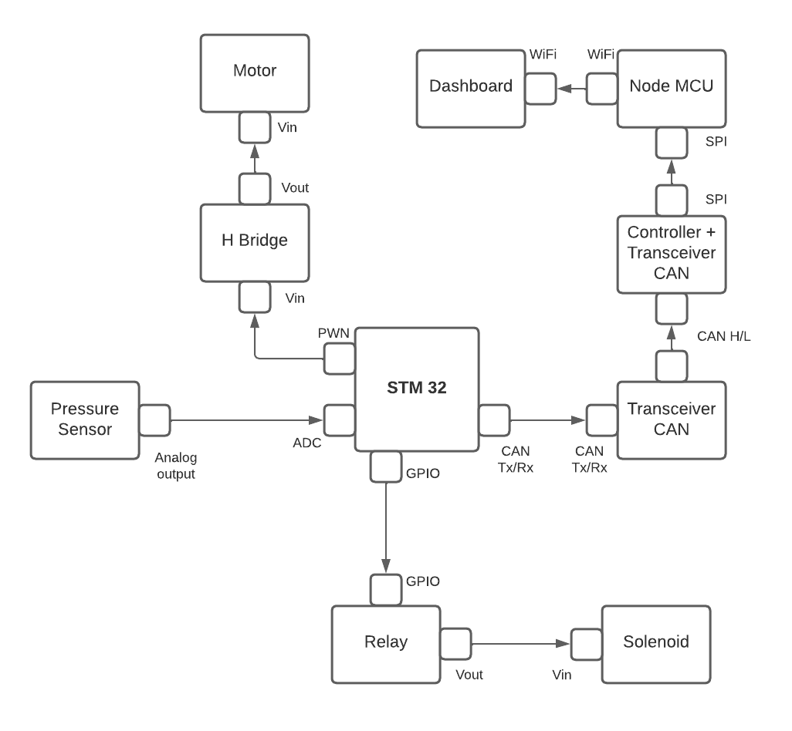
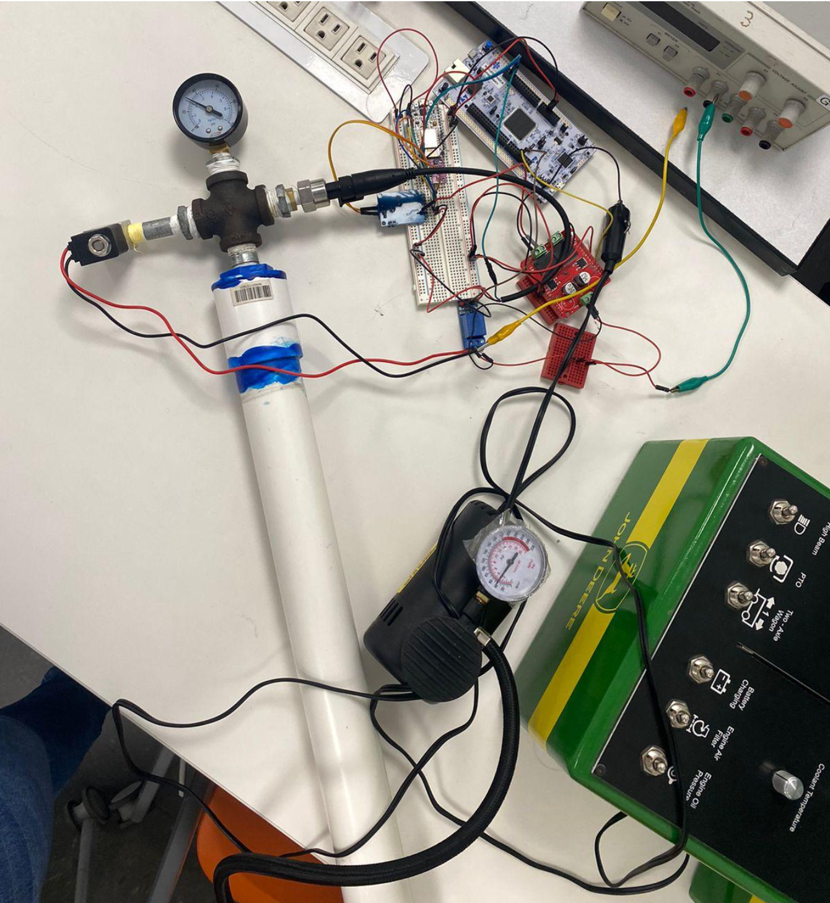

## Intelligent Air Pressure Control System

Built and developed a prototype for an intelligent air pressure control system for tires in agricultural equipment using
linear control strategies. This was a school project in collaboration with John Deere for the advanced embedded systems class in the 5th semester of the B.S. in Robotics and Engineering Systems at Tecnologico de Monterrey.

The theoretical objective of the system is to extend the useful life of tractor tires by dynamically adjusting the necessary air pressure based on the specific terrain, whether it be paved roads or rough terrain.

#### Key tasks
- Used the ARM cortex processor in a dual core STM32 board to carry out the main processing tasks
- Utilized CAN, I2C and UART communication protocols for communication with sensors and a NodeMCU device.
- The prototype had internet connectivity thanks to the Node MCU and was able to both receive commands and send information to a visualization panel via Wi-Fi.

#### Prototype diagram

#### [Watch on youtube](https://youtu.be/Yq0l9Ne1uh4)
